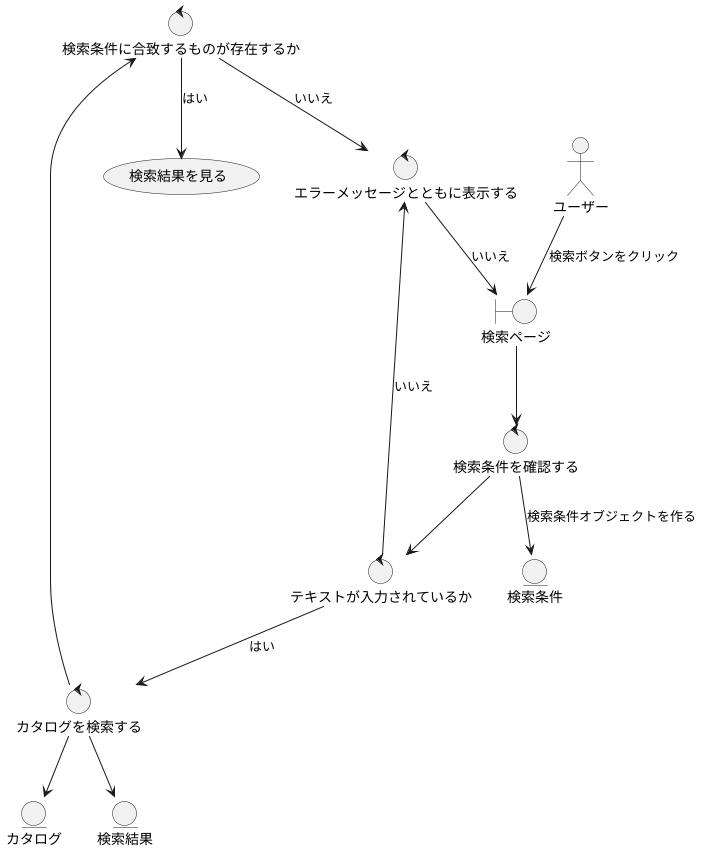
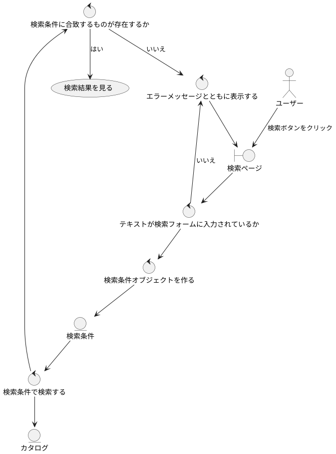

# 書籍を検索する

書くたびに位置がずれるのでかなりつらいです。作図ツールのほうがはやいと思います。

## 修正前

```plantuml
@startuml 書籍を検索する

usecase 検索結果を見る
actor ユーザー
boundary 検索ページ
control 検索条件を確認する
control テキストが入力されているか
control エラーメッセージとともに表示する
entity 検索条件
control カタログを検索する
control 検索条件に合致するものが存在するか
entity カタログ
entity 検索結果

ユーザー --> 検索ページ : 検索ボタンをクリック
検索ページ --> 検索条件を確認する
検索条件を確認する --> 検索条件 : 検索条件オブジェクトを作る
検索条件を確認する --> テキストが入力されているか
テキストが入力されているか --> カタログを検索する : はい
テキストが入力されているか -->  エラーメッセージとともに表示する : いいえ
エラーメッセージとともに表示する -->  検索ページ : いいえ
カタログを検索する --> カタログ
カタログを検索する --> 検索条件に合致するものが存在するか
カタログを検索する --> 検索結果
検索条件に合致するものが存在するか --> エラーメッセージとともに表示する : いいえ
検索条件に合致するものが存在するか --> 検索結果を見る : はい

@enduml
```

## 修正後

```plantuml
@startuml 書籍を検索する

usecase 検索結果を見る
actor ユーザー
boundary 検索ページ
control テキストが検索フォームに入力されているか
control エラーメッセージとともに表示する
entity 検索条件
control 検索条件で検索する
control 検索条件に合致するものが存在するか
control 検索条件オブジェクトを作る
entity カタログ

ユーザー --> 検索ページ : 検索ボタンをクリック
検索ページ --> テキストが検索フォームに入力されているか
テキストが検索フォームに入力されているか --> 検索条件オブジェクトを作る
検索条件オブジェクトを作る --> 検索条件
テキストが検索フォームに入力されているか -->  エラーメッセージとともに表示する : いいえ
検索条件 --> 検索条件で検索する
エラーメッセージとともに表示する -->  検索ページ
検索条件で検索する --> カタログ
検索条件で検索する --> 検索条件に合致するものが存在するか
検索条件に合致するものが存在するか --> エラーメッセージとともに表示する : いいえ
検索条件に合致するものが存在するか --> 検索結果を見る : はい

@enduml
```
